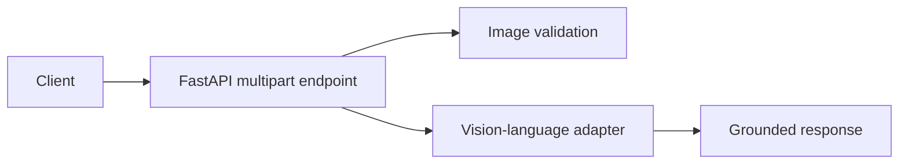

# Multimodal AI Assistant

A safe multimodal request boundary for image plus natural-language instructions. The MVP validates image metadata and keeps the model adapter separate so an open-source vision-language model can be added without changing the API contract.

Run `pip install -r requirements.txt` and `uvicorn app.main:app --reload`. POST multipart fields `instruction` and `image` to `/analyze`.
